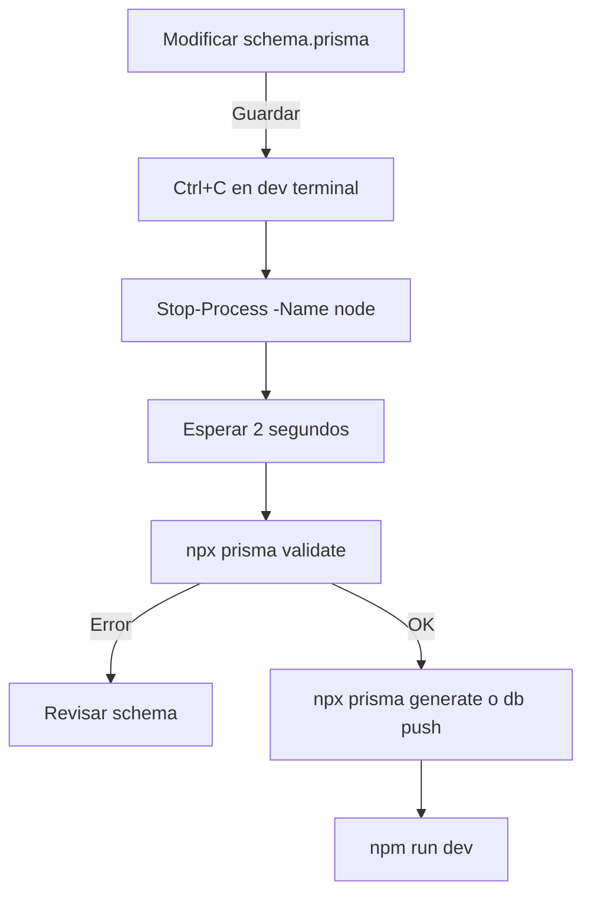

# Troubleshooting Prisma en Windows

**Última actualización:** 2026-01-08  
**Ambiente:** Windows (PowerShell)  
**Versión de Prisma:** 5.7.1

## Problema: Lock en query_engine-windows.dll.node

### Síntomas

```
Error: EPERM: operation not permitted, open 'C:\...\node_modules\.prisma\client\query_engine-windows.dll.node'
```

Este error ocurre cuando:
1. Un proceso Node activo tiene un lock en el archivo de query engine
2. Prisma intenta regenerar o validar el schema
3. El archivo está siendo usado por un dev server, tests, o proceso anterior que no se cerró

### Causa Raíz

El Prisma Client genera un binary `query_engine-windows.dll.node` que es cargado en memoria por:
- `npm run dev` (NestJS dev server)
- `npm run test` (Jest tests)
- Procesos node que no terminaron correctamente

Una vez cargado en memoria, no se puede sobrescribir hasta que el proceso que lo tiene cargado termine.

---

## ✅ Solución Reproducible

### Paso 1: Detectar Procesos Node Activos

```powershell
# Listar todos los procesos node
Get-Process node -ErrorAction SilentlyContinue
```

**Salida esperada:**
```
Handles  NPM(K)    PM(K)      WS(K)     CPU(s)     Id  SI ProcessName
-------  ------    -----      -----     ------     --  -- -----------
    100      45    12345      25000     100.00   5000   1 node
    150      60    15000      35000      50.00   6000   1 node
```

### Paso 2: Detener Procesos de Forma Segura

**Opción A: Usar Stop-Process (Recomendado)**

```powershell
# Detener todos los procesos node
Stop-Process -Name node -ErrorAction SilentlyContinue

# Esperar a que se cierren
Start-Sleep -Seconds 2

# Verificar que no hay procesos node
Get-Process node -ErrorAction SilentlyContinue | Measure-Object
# Si Count = 0, está limpio
```

**Opción B: Ctrl+C en Terminales Activas**

Si tienes dev servers o tests corriendo en terminales:
1. Cambia a cada terminal
2. Presiona `Ctrl+C` para detener el proceso
3. Espera 2 segundos

**Opción C: Kill por PID Específico**

```powershell
# Si sabes el PID
Stop-Process -Id 5000, 6000 -ErrorAction SilentlyContinue
```

### Paso 3: Ejecutar Prisma Validate

```powershell
cd c:\path\to\apps\api
npx prisma validate --schema=prisma/schema.prisma
```

**Salida esperada:**
```
Environment variables loaded from .env
Prisma schema loaded from prisma\schema.prisma
The schema at C:\...\prisma\schema.prisma is valid 🚀
```

### Paso 4: Ejecutar Prisma Generate

```powershell
cd c:\path\to\apps\api
npx prisma generate --schema=prisma/schema.prisma
```

**Salida esperada:**
```
Environment variables loaded from .env
Prisma schema loaded from prisma\schema.prisma

✔ Generated Prisma Client (v5.7.1) to .\node_modules\@prisma\client in 664ms

Start using Prisma Client in Node.js (See: https://pris.ly/d/client)
...
```

---

## 📝 Procedimiento Completo (One-Liner)

```powershell
# Detener todos los node, validar y generar
Stop-Process -Name node -ErrorAction SilentlyContinue; `
Start-Sleep -Seconds 2; `
cd c:\Users\DanielVillamizar\GanaderiaRegenerativa\apps\api; `
npx prisma validate --schema=prisma/schema.prisma; `
npx prisma generate --schema=prisma/schema.prisma
```

O en PowerShell multiline (más legible):

```powershell
# 1. Detener procesos node
Stop-Process -Name node -ErrorAction SilentlyContinue

# 2. Esperar
Start-Sleep -Seconds 2

# 3. Ir a api
cd c:\Users\DanielVillamizar\GanaderiaRegenerativa\apps\api

# 4. Validar schema
npx prisma validate --schema=prisma/schema.prisma

# 5. Generar Client
npx prisma generate --schema=prisma/schema.prisma
```

---

## 🔍 Debugging: Qué Archivo Bloquea Query Engine

Si aún tienes problemas de lock, identifica qué proceso exacto lo bloquea:

```powershell
# Buscar qué proceso tiene el archivo abierto
# (Requiere herramientas adicionales, ej. Sysinternals)
# En PowerShell puro, puedes verificar con:

$path = "C:\Users\DanielVillamizar\GanaderiaRegenerativa\apps\api\node_modules\.prisma\client\query_engine-windows.dll.node"

# Intentar acceder al archivo
try {
    [System.IO.File]::Open($path, 'Open', 'Read') | ForEach-Object { $_.Close() }
    Write-Host "Archivo está libre"
} catch {
    Write-Host "Archivo está bloqueado: $($_.Exception.Message)"
}
```

---

## ❌ Qué NO Hacer

### ❌ No borres .prisma/client como solución final

```powershell
# ❌ EVITAR - Esto causa problemas de inconsistencia
Remove-Item ".\node_modules\.prisma\client" -Recurse -Force
```

**Por qué:** 
- Regenerar desde cero es lento
- Puede causar inconsistencias con tipos en src/
- Es un workaround, no la solución raíz

**En su lugar:** Detén los procesos (solución real)

### ❌ No intentes sobrescribir el archivo mientras está en uso

```powershell
# ❌ EVITAR
del ".\node_modules\.prisma\client\query_engine-windows.dll.node"
```

**Por qué:** Resultará en "access denied" si hay un lock

### ❌ No ejecutes prisma mientras hay procesos node activos

```powershell
# ❌ EVITAR - prisma fallará
npm run dev &  # background
npx prisma generate  # lock error
```

---

## ✨ Integración en Workflow

### Pre-Dev Setup

Antes de `npm run dev`, asegúrate de que prisma esté generado:

```powershell
# Script de setup
Stop-Process -Name node -ErrorAction SilentlyContinue
Start-Sleep -Seconds 2
cd c:\Users\DanielVillamizar\GanaderiaRegenerativa\apps\api
npx prisma generate --schema=prisma/schema.prisma
npm run dev
```

### Pre-Test Setup

Antes de `npm run test`, limpia procesos:

```powershell
Stop-Process -Name node -ErrorAction SilentlyContinue
Start-Sleep -Seconds 2
cd c:\Users\DanielVillamizar\GanaderiaRegenerativa\apps\api
npm run test
```

### Post-Schema Changes

Después de modificar `schema.prisma`:

```powershell
# 1. Detén dev server (Ctrl+C en la terminal)
# 2. Ejecuta:
Stop-Process -Name node -ErrorAction SilentlyContinue
Start-Sleep -Seconds 2
npx prisma migrate dev --name "tu_migracion"
# o
npx prisma db push
npx prisma generate --schema=prisma/schema.prisma
```

---

## 🔄 Flujo Recomendado

### Para Desarrollo Local



### Para Cambios en Migraciones

```powershell
# 1. Detener procesos
Stop-Process -Name node -ErrorAction SilentlyContinue
Start-Sleep -Seconds 2

# 2. Crear/aplicar migración
npx prisma migrate dev --name "nombre_migracion"

# 3. Generar
npx prisma generate --schema=prisma/schema.prisma

# 4. Reiniciar dev
npm run dev
```

---

## 📋 Checklist de Resolución

Si `prisma generate` falla con lock:

- [ ] ¿Hay procesos node activos? → `Get-Process node`
- [ ] ¿Dev server en otra terminal? → Cierra con Ctrl+C
- [ ] ¿Tests corriendo? → Detén con Ctrl+C
- [ ] Ejecutaste `Stop-Process -Name node`? 
- [ ] Esperaste 2 segundos? → `Start-Sleep -Seconds 2`
- [ ] Intentaste de nuevo? → `npx prisma generate`

Si aún falla:
- [ ] Reinicia PowerShell (cierra y abre nueva)
- [ ] Verifica `node_modules\.prisma` no esté corrupto
- [ ] Si todo falla: `npm install` (reinstala dependencias)

---

## 📚 Referencias

- [Prisma Windows Troubleshooting](https://pris.ly/d/windows-engine)
- [Prisma CLI: generate](https://pris.ly/d/cli-generate)
- [Prisma CLI: validate](https://pris.ly/d/cli-validate)
- [Prisma Migrate](https://pris.ly/d/migrate)

---

## 📌 Última Ejecución Exitosa

**Fecha:** 2026-01-08  
**Procesos detenidos:** PIDs 368, 30796, 31832  
**Comandos ejecutados:**

```powershell
# Detener
Stop-Process -Id 368, 30796, 31832 -ErrorAction SilentlyContinue
Start-Sleep -Seconds 2

# Validar
npx prisma validate --schema=prisma/schema.prisma
# ✓ The schema at C:\...\prisma\schema.prisma is valid 🚀

# Generar
npx prisma generate --schema=prisma/schema.prisma
# ✓ Generated Prisma Client (v5.7.1) to .\node_modules\@prisma\client in 664ms
```

**Resultado:** ✅ Exit code 0 - Sin errores

---

**Mantenido por:** Arquitecto de Software / Prisma Expert  
**Próxima revisión:** Después de upgrade major de Prisma
